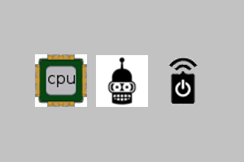

# BASIC_ROBOT

 

## What is this?

This repository holds a fork to the lua-code of a lightweight robot-mod for minetest-multiplayer initially created by ``rnd`` called ``basic_robot``.

**ATTENTION**: It may or may not be compatible with the basic_robot-mod written by ``rnd``, because it will get some changes which change the behavior different to the original or may have features the original will not have.

## How to install?

Locate the mods-folder of your minetest(-server)-installation.

Click the *clone or download*-button in GitHub-Repository and download the ZIP-file to the mods-folder by clicking *Download ZIP* or if you have git installed call the following in your mods-folder:
	
	git clone git@github.com:mflink3012/basic_robot.git

Now you can select this mod in you minetest-client for singleplayer (e.g. for testing). If you want to use it on your minetest-server you have to edit the world's corresponding ``world.mt`` (inside the specific world-folder) and add

	load_mod_basic_robot = true

to its end.

## Which dependencies?

Currently none essential, but some optional.
See shipped ``depends.txt``.

## How to use?

The user-documentation is shipped inside the game.
Just open the spawner-menu (CPU-menu) and click on the ?-button for help.

For learning Lua read <https://www.lua.org/manual/5.1/>.

For ideas and some scripts look at the shipped ``scripts``-folder and/or <https://wiki.minetest.net/Mods/basic_robot>.

## Known issues?

See the ``issues``-tab in GitHub-Repository.

## Tested with?

minetest 0.4.15

## What license?

GPL 3.0 (See the ``LICENSE``-file shipped or <https://www.gnu.org/licenses/gpl-3.0.txt> for details.)
